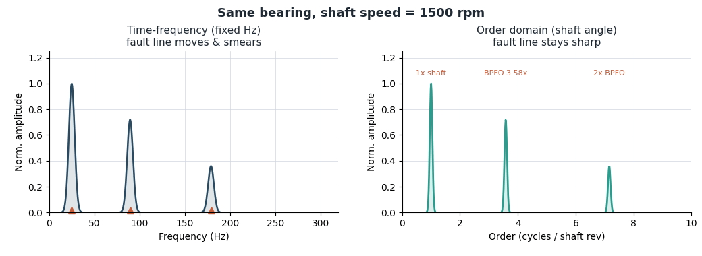
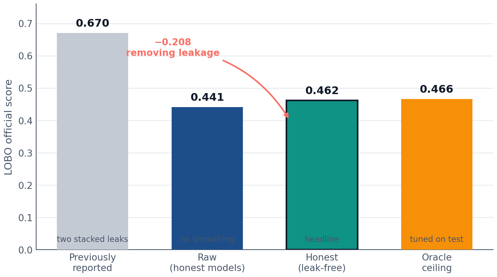
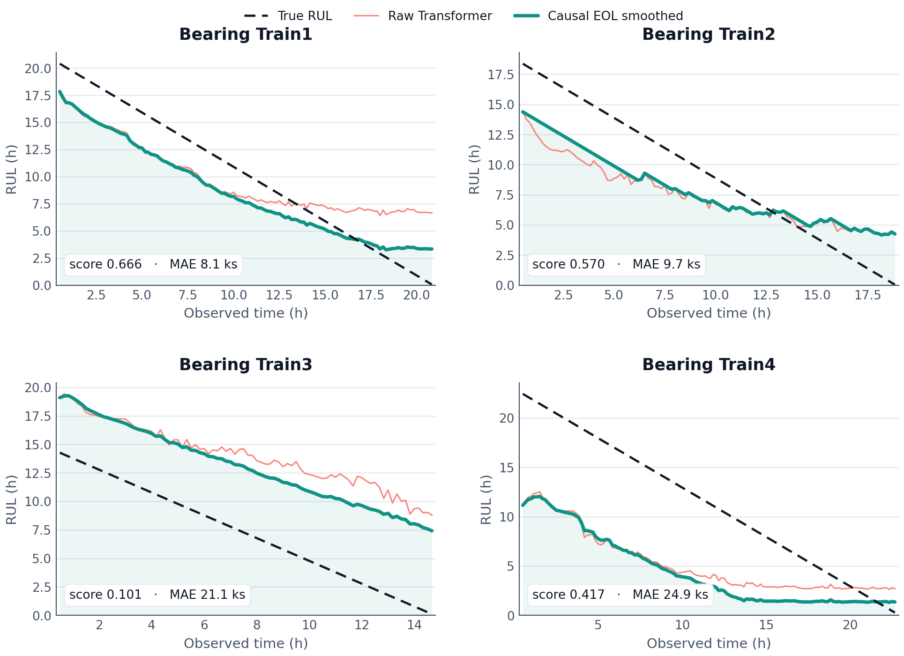
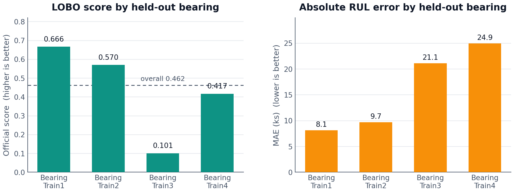
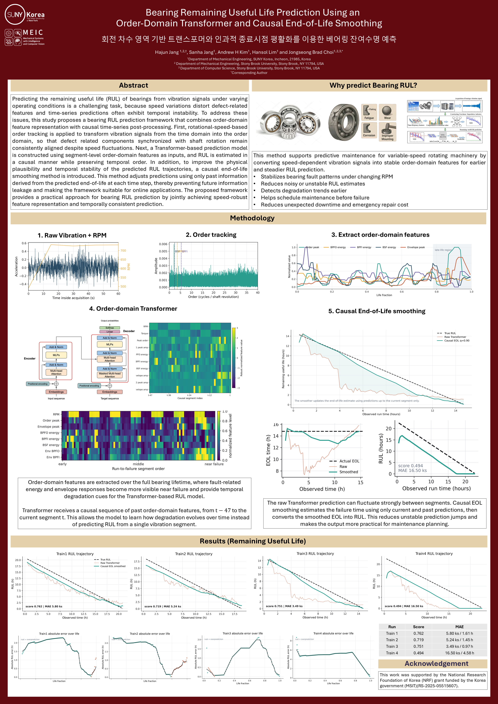

# PHM Korea 2026 — Order-Domain Transformer for Bearing RUL

> **Speed-robust bearing remaining-useful-life prediction: rotational order tracking, a time-gap-aware Transformer, and causal end-of-life smoothing — evaluated without test-set leakage.**

[](https://www.phm.or.kr/)
[](LICENSE)

[](https://github.com/hajun011103/Bearing-RUL-OrderTransformer/actions/workflows/ci.yml)

Code, honest leak-free evaluation, and figures for the PHM Korea 2026 poster
**"Bearing Remaining Useful Life Prediction Using an Order-Domain Transformer and
Causal End-of-Life Smoothing"** (Jang, Jang, Kim, Lim & Choi, SUNY Korea).

<p align="center">
  <br>
  <em>As the shaft speed sweeps up, a bearing-defect line moves in the fixed-Hz spectrum and, integrated over the acquisition, smears into a broad hump (left); in the order domain it stays a sharp line (right). This speed-robustness is why the pipeline works on the order domain. Regenerate with <code>python scripts/make_hero_gif.py</code>.</em>
</p>

## Contents

- [Overview](#overview)
- [Why the order domain](#why-the-order-domain)
- [Results](#results)
- [Quickstart](#quickstart)
- [Data](#data)
- [Repository Layout](#repository-layout)
- [Poster](#poster)
- [How to Cite](#how-to-cite)
- [License](#license)

## Overview

Predicting the remaining useful life (RUL) of a bearing from vibration is hard
under *varying operating speed* for two reasons: speed changes smear defect-related
spectral features, and segment-level predictions are temporally unstable. The
method is a compact, physically motivated pipeline with three stages:

1. **Order tracking.** Each 60-second vibration acquisition is resampled from time
   onto the shaft-angle grid, so bearing-defect components (BPFO / BPFI / BSF / FTF
   and their harmonics) stay at fixed *orders* regardless of RPM drift. Compact
   order-domain and envelope-order fault-band features are extracted per segment
   ([`order_spectrum`, `extract_segment_features`](src/phm_pipeline/features.py)).
2. **Time-gap-aware Transformer.** A Transformer encoder reads the causal history of
   segment-level order-domain features and encodes both the true elapsed time and the
   gaps between acquisitions, then predicts RUL — so it learns how degradation evolves
   over time rather than from a single segment ([`RULTransformer`](src/phm_pipeline/model.py)).
3. **Causal end-of-life (EOL) smoothing.** Each RUL trajectory is post-processed with
   a causal running quantile of the *predicted* end-of-life, using only information up
   to the current step. This removes segment-to-segment jitter without ever peeking
   into the future, so it is safe for online use
   ([`apply_temporal_postprocess`](src/phm_pipeline/training.py)).

## Why the order domain

When the shaft speed changes during an acquisition, a fixed-Hz FFT smears each
bearing-defect line into a broad hump, because the defect's frequency moves with RPM
(the animation above). Resampling onto shaft angle pins every defect to a fixed
*order*, so the fault lines stay sharp and comparable across segments recorded at
different speeds — a cleaner, speed-invariant input for the model.

## Results

The headline evaluation is **leave-one-bearing-out (LOBO)** on the four PHM Korea
run-to-failure bearings, scored with the official competition score (higher is
better, max 1.0). Every hyper-parameter that touches a held-out bearing is chosen
*without looking at it*: models are early-stopped on a tail split of the training
bearings, and the EOL-smoothing hyper-parameters are selected by an **inner LOBO**
over the training bearings ([`scripts/run_lobo.py`](scripts/run_lobo.py)).

The honest, leak-free headline is **0.462** (MAE 15.9 ks). An earlier version
reported 0.670 — the figure below shows why.

<p align="center">
  <br>
  <em>Two leaks inflated the earlier <b>0.670</b>: the smoothing quantile was tuned on the test folds, and each model was early-stopped on the bearing it was scored on. Removing both gives the honest <b>0.462</b>. The raw score (no smoothing) is 0.441, and the leak-free smoothing is already within 0.004 of the oracle ceiling (0.466). The full accounting is in <a href="docs/experiments.md"><code>docs/experiments.md</code></a>.</em>
</p>

<p align="center">
  <br>
  <em>Honest LOBO RUL trajectories: the raw Transformer (coral), the causal-EOL-smoothed prediction (teal), and the true RUL (dashed). Smoothing stabilizes each trajectory using only past predictions.</em>
</p>

<p align="center">
  <br>
  <em>Per-bearing score and error. With only four bearings the variance is high — from ~0.10 (Train3, which generalizes poorly) to ~0.67 (Train1).</em>
</p>

> **Honest negative results.** A secondary *late-life tail* test — predict the last
> 25% of each bearing from its early life, with the scale and smoothing selected on an
> inner split — scores only **0.086** (100% over-predicted). A model that has never
> seen a near-death bearing systematically over-estimates remaining life, which is
> exactly why leave-one-**bearing**-out (the model sees complete lives of the *other*
> bearings) is the meaningful protocol. An external **PRONOSTIA / FEMTO** domain-shift
> check reaches ~0.38 and is a robustness probe, not a benchmark. See
> [`docs/experiments.md`](docs/experiments.md).

## Quickstart

Requires **Python 3.11**. The extracted order-domain feature table is committed, so
the modeling runs on CPU in minutes without the multi-GB raw signals.

```bash
# 1. Install
python -m pip install -e .          # or: pip install -r requirements.txt
#    (conda: conda env create -f environment.yml && conda activate phm-korea-rul)

# 2. Honest leave-one-bearing-out (writes artifacts/runs/lobo_order_domain_nested/)
python scripts/run_lobo.py

# 3. Honest late-life tail diagnostic
python scripts/run_tail_validation.py

# 4. Regenerate the figures
python scripts/make_hero_gif.py
python scripts/make_result_figures.py
```

`run_lobo.py` prints the raw / honest / oracle table and writes
`nested_lobo_summary.json` plus the out-of-fold predictions.

## Data

The raw bearing archives are **not** in this repository (each vibration ZIP is
multi-GB, and the challenge data is not redistributable). Only the small extracted
order-domain feature table under `artifacts/features/` is shipped. To rebuild it from
the raw data:

```bash
python scripts/extract_features.py \
  --data-root data/Train \
  --output artifacts/features/train_full.parquet

python scripts/make_order_domain_features.py \
  --source artifacts/features/train_full.parquet \
  --output artifacts/features/train_full_order_domain.parquet \
  --feature-mode order
```

**Where to get the data.** The PHM Korea challenge bearing data comes from the
**KIMM Data Platform** (participant/registration access — not redistributable), and
the external check uses the public **NASA FEMTO / PRONOSTIA** dataset. Exact,
fetch-verified download links and access terms — plus public variable-speed
substitutes (XJTU-SY, U. Ottawa, KAIST) — are in [`docs/data.md`](docs/data.md).

## Repository Layout

- `src/phm_pipeline/`: the core library (the abstract method only) — `data.py`
  (TDMS/ZIP + operation loading), `features.py` (order tracking + fault-band
  features), `model.py` (`RULTransformer`), `losses.py` (official score + asymmetric
  loss), `training.py` (datasets, training loop, causal smoothing, export).
- `scripts/`: CLI entry points — feature extraction, `run_lobo.py`,
  `run_tail_validation.py`, figure generation, external PRONOSTIA check.
- `tests/`: unit tests (`pytest`).
- `docs/`: [`data.md`](docs/data.md) (data sources) and
  [`experiments.md`](docs/experiments.md) (design decisions + negative results).
- `artifacts/features/`: the committed order-domain feature table.
- `figures/results/`: figures regenerated from the honest runs.

Exploratory branches (wavelet / FNO / GRU encoders, DMD/SINDy dynamics features and
augmentation, learned calibration, a physics loss, adaptive envelope and
condition/equivalent-age features) were removed to keep the codebase focused on the
abstract method; the rationale is recorded in [`docs/experiments.md`](docs/experiments.md).

## Poster

<p align="center">
  
</p>

Submission files: [poster (PDF)](HajunJang_PHMKorea2026Posterv2.pdf) ·
[abstract (PDF)](HajunJang_PHMKorea2026_abstract.pdf).

> The poster is the **as-submitted** artifact. Its per-bearing scores (~0.49–0.76,
> with q = 0.90 smoothing) come from the earlier evaluation protocol; the honest,
> leak-free re-evaluation in this repository is the **0.462** headline above. The
> difference is accounted for in [`docs/experiments.md`](docs/experiments.md).

## How to Cite

If you use this code or its results, please cite the PHM Korea 2026 paper:

> Hajun Jang, Sanha Jang, Andrew H. Kim, Hansol Lim, and Jongseong Brad Choi,
> "Bearing Remaining Useful Life Prediction Using an Order-Domain Transformer and
> Causal End-of-Life Smoothing," *PHM Korea 2026 Conference* (Korean Society for
> Prognostics and Health Management), Republic of Korea, 2026.

A machine-readable citation is in [`CITATION.cff`](CITATION.cff). (The exact
proceedings page and DBpia record are left as a `# TODO` until publication.)

### Acknowledgment

This work was supported by the National Research Foundation of Korea (NRF) grant
funded by the Korea government (MSIT) (No. RS-2025-05515607).

## License

Released under the [MIT License](LICENSE). The license covers the source code only;
the bearing datasets remain under their original terms.
